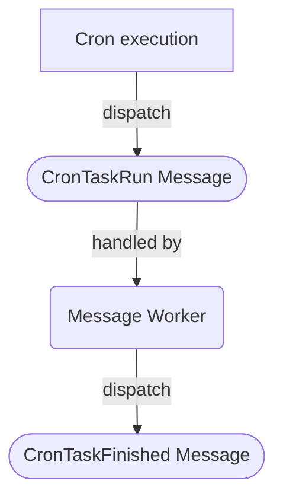

# Cronjobs

## Running regular cronjobs
Crons are run by executing the CronCommand from the command line.
By default this will run all available cronjobs not run in the last 23 hours.

```bash
    bin/console commsy:cron:main
```

## How cronjobs are processed
Running a cron will dispatch an async message, that will be picked up
by a runner and finally performed.
If a job is successfull another message is dispatched to update the last
run in the cron table.

